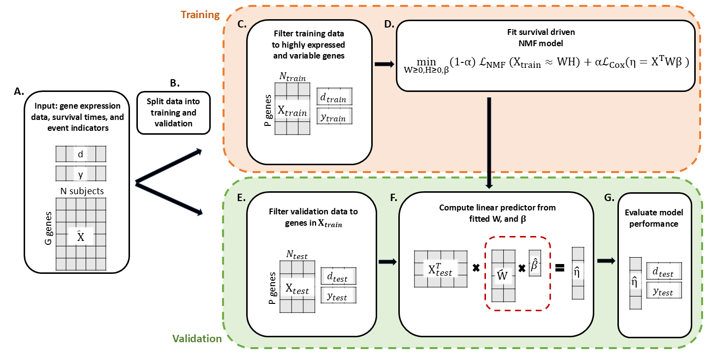

```{r}
library(targets)
library(dplyr)
library(ggplot2)
library(survival)
library(survminer)
PKG_VERSION        = utils::packageDescription("coxNMF", fields = "RemoteRef")
GIT_BRANCH         = gert::git_branch()
store=paste0("store_PKG_VERSION=",PKG_VERSION,"_GIT_BRANCH=",GIT_BRANCH)
tar_config_set(store=store)

```


## The NMF–Cox framework provides an end-to-end workflow for prognostic modeling

We developed an integrated framework that combines nonnegative matrix factorization (NMF) with Cox proportional hazards regression to identify latent gene expression factors associated with survival. As illustrated in Figure 1, the workflow begins with preprocessing and normalization of RNA-seq data, followed by NMF decomposition into patient factor loadings ($W$) and gene weightings ($H$). A Cox model is then fit using projected covariates derived from W. The framework incorporates a balancing parameter $\alpha$ to control the relative influence of reconstruction error versus survival likelihood. Model selection is performed via cross-validation across k, penalty parameters, and $\alpha$, with downstream evaluation focusing on both predictive performance and biological interpretability.

```{r fig-schema, fig.cap="DeSurv overview", fig.env='figure*', fig.pos='t', out.height= "4in", out.width='\\textwidth'}

```

## The NMF–Cox model shows consistent convergence and stability across restarts

Across datasets and initialization schemes, the NMF–Cox algorithm consistently converged to numerically stable solutions within the designated iteration budget. Warm-start strategies, in which solutions at $\alpha=0$ initialized supervised runs, substantially reduced variability across restarts and improved reproducibility. Figure 2 shows representative loss trajectories demonstrating monotone decreases until convergence, while Figure 3 summarizes performance variability across restarts. Compared with naïve random initialization, warm-starts produced tighter distributions of cross-validated C-index and partial likelihood, confirming stability of the optimization procedure.

```{r fig-converge, fig.width = 6, fig.height= 4, fig.cap="Convergence of model for k=8 alpha=.5" , fig.env='figure*', fig.pos='t', out.height= "4in", out.width='\\textwidth'}
tar_load(full_model)
runs=readRDS(full_model)
# iter_cold = 

iters = list()
for(i in 1:5){
  lossit = runs[[i]]$fits[[as.character(0.5)]]$lossit
  lossit = data.frame(lossit=lossit,iter=1:length(lossit))
  lossit$init=i
  iters[[i]] = lossit
}

lossit=dplyr::bind_rows(iters) %>% filter(iter<5000)

ggplot(lossit,aes(y=lossit,x=iter,color=as.factor(init)))+
  geom_line(linewidth=.8)+
  theme_minimal()+
  labs(x="Iteration",y="Loss",color="Initialization")

```


## Cross-validation of NMF–Cox identifies parameter settings that balance prediction and reconstruction

We evaluated performance across a grid of factor ranks (k), penalties, and values of $\alpha$. Cross-validated C-index varied modestly across conditions, with no consistent improvement for 
$\alpha>0$. Instead, supervised extensions altered the orientation of latent factors while maintaining comparable discrimination. Figure \@ref(fig::fig-cv)A shows a heatmap of mean C-index across k and $\alpha$, and \@ref(fig::fig-cv)B illustrates C-index trends across $\alpha$ stratified by rank. 

```{r fig-cv, fig.width = 6, fig.height= 4, fig.cap="A. Heatmap of cross-validated C-index across key parameters k and alpha. B. Cross validated C-index by alpha with standard error bars, stratified by k." , fig.env='figure*', fig.pos='t', out.height= "4in", out.width='\\textwidth'}
tar_load_globals()
tar_load(cv_metrics)
mets_test=cv_metrics$mets_test
avg_init = mets_test %>% group_by(k,fold,alpha,lambda,eta,lambdaW) %>%
  summarize(c_mean_f = mean(c), pl_mean_f=mean(sloss))%>%
  ungroup()
avg_fold = avg_init %>% group_by(k,alpha,lambda,eta,lambdaW) %>%
  summarize(c_mean = mean(c_mean_f), pl_mean = mean(pl_mean_f),
            c_sd = sqrt(sum((c_mean_f-c_mean)^2)/(NFOLD*(NFOLD-1))), 
            pl_sd = sqrt(sum((pl_mean_f-pl_mean)^2)/(NFOLD*(NFOLD-1))))%>%
  ungroup()
avg_fold_fixed_lambda = avg_fold %>% filter(lambda==10)

heat = ggplot(avg_fold_fixed_lambda,aes(x=alpha,y=k,fill=c_mean))+
  geom_tile()+
  theme_classic(base_size=11)+theme(panel.grid = element_blank(),
                                    axis.line  = element_blank())+
  scale_y_continuous(expand=c(0,0),breaks=1:12)+
  scale_x_continuous(expand=c(0,0),breaks = c(0,.25,.5,.75,1))+
  labs(fill="CV C-index")+
  scale_fill_viridis_c(option="magma",direction=-1,labels=scales::label_number(accuracy=0.01))

avg_fold_sub_k = avg_fold_fixed_lambda %>% filter(k %in% c(4,6,8,12))
avg_fold_sub_k$k_lab = factor(avg_fold_sub_k$k, labels=paste0("k = ",c(4,6,8,12)))

panels = ggplot(avg_fold_sub_k, aes(x=alpha,y=c_mean))+
  geom_point()+
  geom_line()+
  geom_errorbar(aes(ymin=c_mean-c_sd, ymax = c_mean+c_sd))+
  theme_minimal(base_size=11)+
  theme(strip.background = element_rect(fill="white",color=NA),
        strip.text = element_text(color="black"))+
  facet_wrap(~k_lab)+
  labs(y="CV C-index")

ggpubr::ggarrange(heat,panels,ncol=2,nrow=1,labels=c("A","B"),widths=c(5,4))


```


## NMF–Cox uncovers biologically interpretable latent factors associated with clinical outcomes

Despite limited performance gains from supervision, the latent factors identified by NMF–Cox exhibited strong biological interpretability. The projected covariates, $W^TX$, aligned with known clinical and molecular subtypes, including basal-like versus classical subgroups in pancreatic cancer (Figure 7). Kaplan–Meier curves stratified by factor exposures revealed significant survival differences (Figure 8), supporting the prognostic relevance of the factors. At the gene level, W highlighted pathway-level enrichment for immune signaling, stromal activity, and hallmark oncogenic processes. Overlap analysis (Figure 9) demonstrated consistency with external signatures, confirming that NMF–Cox produces reproducible biological features.

```{r fig-bio}

```


## NMF–Cox factors generalize to independent cohorts in external validation

To assess generalizability, models trained on TCGA-PAAD and CPTAC were applied to external cohorts including PACA, Moffitt, and Puleo. Factor exposures in validation datasets recapitulated subgroup structures identified in training and stratified patients into groups with distinct survival outcomes (Figure 10). Factor correlation analyses (Figure 11) confirmed reproducibility of core latent dimensions, particularly those separating basal-like and classical subtypes. Predictive accuracy in external cohorts was comparable to cross-validation results, with simpler models ($k\leq 5$) showing greater reproducibility. These findings indicate that NMF–Cox captures transferable biological signals across studies. 

```{r fig-external, fig.width = 6, fig.height= 4, fig.cap="Kaplan Meier curves for a median split on A. linear predictor, B. Factor 2, C. Factor 3" , fig.env='figure*', fig.pos='t', out.height= "4in", out.width='\\textwidth'}
tar_load(full_model)
b = readRDS(full_model)
tar_load(best_params)
tar_load(full_metrics)
best_metrics = full_metrics %>% filter(alpha==best_params$alpha)
best_init = best_metrics %>% slice_max(order_by=c,n=1)
best_seed = best_init$seed

fit=b[[best_seed]]$fits[[as.character(best_params$alpha)]]
W = fit$W

VAL_PREFIX = paste0(VAL_DATASETS, collapse = ".")
data = readRDS(paste0("data/derv/",VAL_PREFIX,"_formatted.rds"))

# linehan = readRDS("data/derv/linehan_formatted.rds")
# dijk = readRDS("data/derv/dijk_formatted.rds")
# moff =readRDS("data/derv/moffitt_formatted.rds")
# paca_seq = readRDS("data/derv/paca_seq_formatted.rds")
# paca_array = readRDS("data/derv/paca_array_formatted.rds")
# puleo = readRDS("data/derv/puleo_formatted.rds")
# 
# datasets = list(linehan,dijk,moff,paca_seq,paca_array,puleo)

plots = validate(data,W,fit$beta,fit$sdZ,fit$meanZ)

ggarrange(plots[[1]],plots[[2]],plots[[3]], labels=c("A","B","C"), ncol=3)

# for(d in datasets){
#   validate(d,W,fit$beta,fit$sdZ,fit$meanZ)
# }

```

