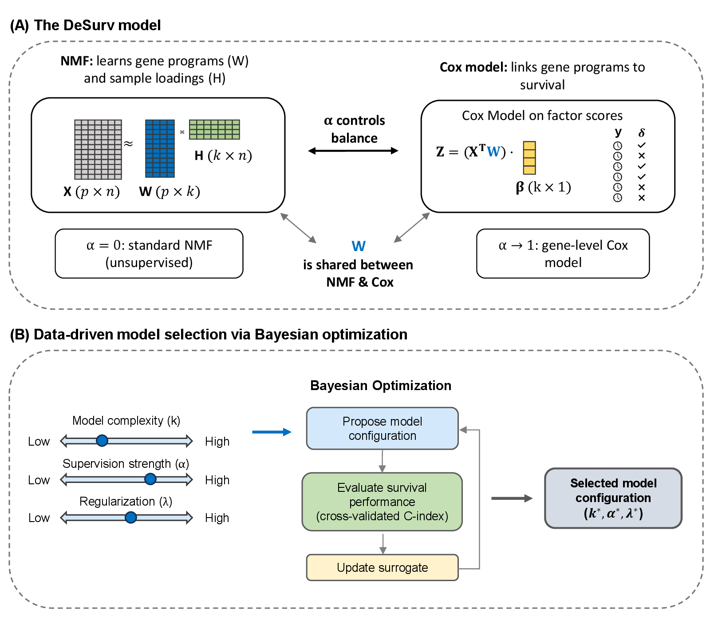
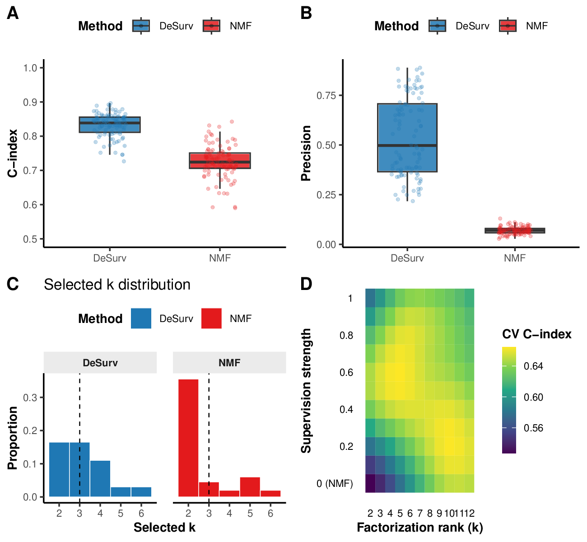
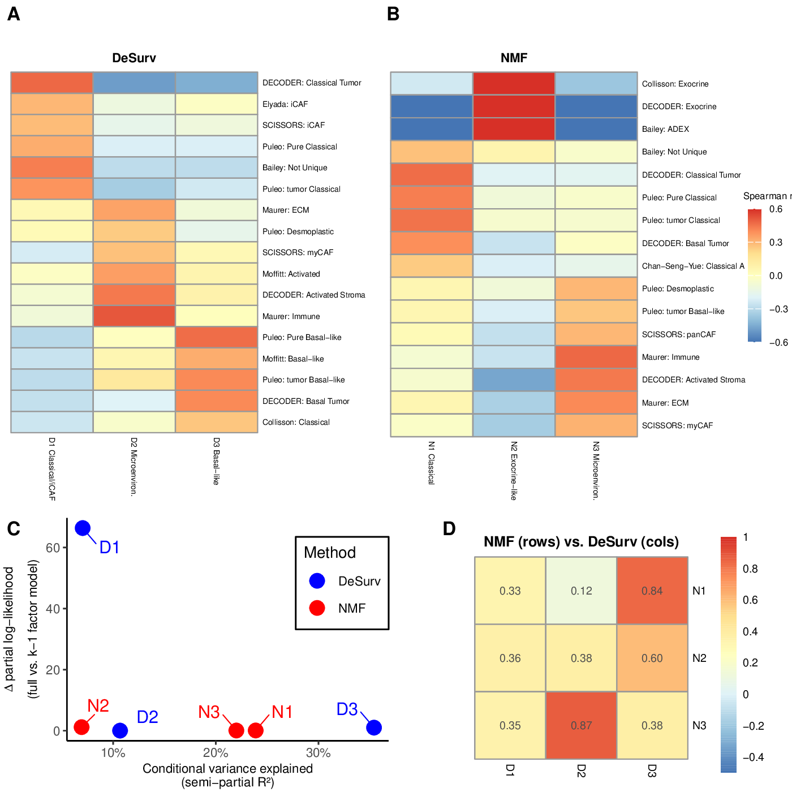
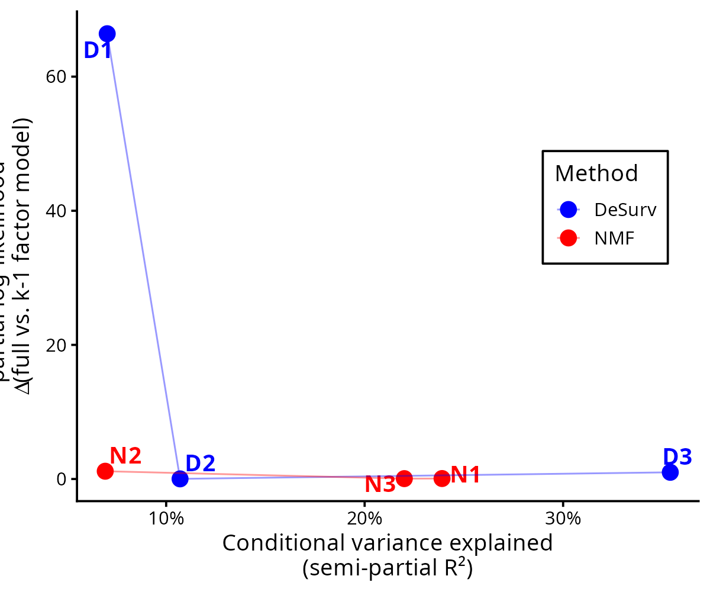
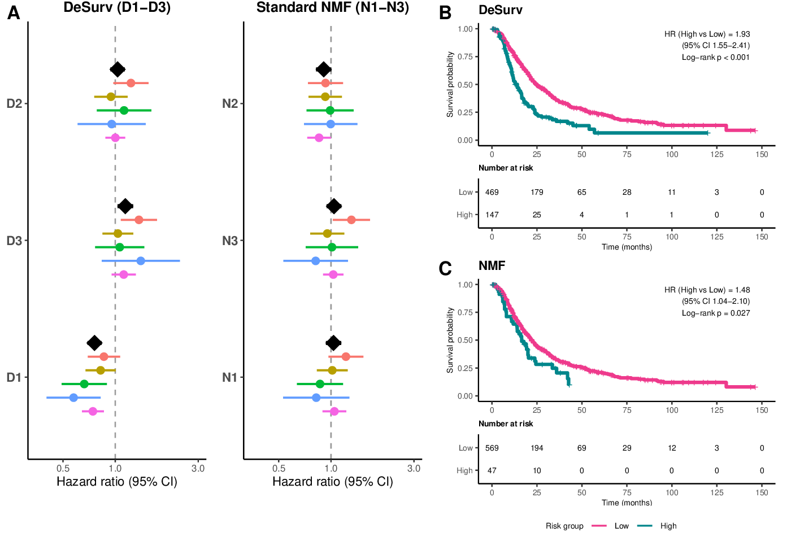

```{r}
#| label: setup
#| include: false

library(knitr)
```

# DeSurv: The Idea

## The Problem: Variance $\neq$ Prognosis

- **Standard NMF** minimizes reconstruction error --- factors capture highest-variance signals
- In PDAC: exocrine/purity variation dominates expression variance
- Prognostic programs may be diluted or split across factors
- **DeSurv** adds survival supervision to NMF, shaping gene programs toward outcome-relevant structure

**Objective:**
$$\min_{W,H} \; \|X - WH\|_F^2 \;+\; \alpha \cdot \left(-\ell_{\text{Cox}}(\beta, H)\right)$$

- $\alpha = 0$: standard NMF; $\alpha > 0$: survival shapes gene programs
- Gradient acts on $W$ only --- preserves $H$ as mixture coefficients
- New samples scored by projection: $Z = \tilde{W}^\top X_{\text{new}}$ (no survival data needed)

## Method Schematic

{fig-align="center" width="95%"}

## Simulations + Model Selection

{fig-align="center" width="95%"}


# Results in PDAC

## DeSurv Factor Structure vs. Standard NMF

{fig-align="center" width="95%"}

## Signature Overlaps: DeSurv vs. Established Programs {.smaller}

:::: {.columns}

::: {.column width="50%"}

**DeSurv ($k = 3$)**

- **D1 (Classical/iCAF):** DECODER Classical Tumor, Elyada iCAF, SCISSORS iCAF, Puleo Classical
- **D2 (Microenvironment):** DECODER Activated Stroma, Maurer Immune/ECM, Moffitt Activated
- **D3 (Basal-like):** Puleo/Moffitt Basal-like, DECODER Basal Tumor, Collisson Classical

:::

::: {.column width="50%"}

**Standard NMF ($k = 3$)**

- **N1 (Classical):** Classical programs only
- **N2 (Exocrine):** Collisson/DECODER Exocrine, Bailey ADEX --- captures **purity variation**, not cancer biology
- **N3 (Microenvironment):** Stroma + immune mixed together

:::

::::

::: {.callout-important}
**Key difference:** DeSurv couples classical tumor + iCAF stroma in D1 (the most prognostic factor). Standard NMF separates these and allocates a factor to exocrine variation instead.
:::


## Alignment with deCAF Findings {.smaller}

:::: {.columns}

::: {.column width="55%"}

**Peng et al. (2024, Cell Reports Medicine) --- deCAF:**

- Survival depends on **joint tumor--stroma configuration**
- proCAF (activated) vs. restCAF (resting) fibroblast programs
- Prognosis not purely tumor-intrinsic

**DeSurv D1 recovers this coupling de novo:**

- D1 correlates with both classical tumor programs AND restCAF/iCAF stroma
- Co-occurrence within a single factor = prognostically relevant tumor--stroma coupling
- Recovered **without pre-specified signatures**, purely from survival supervision

:::

::: {.column width="45%"}

**Consistency check:**

| DeSurv | deCAF alignment |
|--------|----------------|
| D1 classical + iCAF | restCAF (favorable) |
| D2 activated stroma | proCAF-like (unfavorable) |
| D3 basal-like | Basal tumor identity |

DeSurv's survival-driven factor structure is **consistent** with deCAF's experimentally validated tumor--stroma subtypes.

:::

::::


## Variance vs. Survival: The Core Insight

{fig-align="center" width="75%"}

- **D1** (DeSurv): moderate variance, **largest survival contribution** by far
- **N2** (NMF): highest variance, **negligible survival contribution** --- exocrine/purity factor
- The highest-variance signals are not the most prognostic

## External Validation: DeSurv Generalizes

{fig-align="center" width="95%"}

- **D1** consistently protective across all 5 cohorts (pooled HR = 0.76)
- KM: DeSurv linear predictor HR = 1.93 vs. NMF HR = 1.48


# Gene Lists

## Top 270 Genes Per Factor (DeSurv $k = 3$) {.smaller .scrollable}

```{r}
#| label: gene-table-desurv

gene_data <- read.csv("gene_lists_top270_k3.csv")
desurv_genes <- gene_data[gene_data$factor %in% c("D1", "D2", "D3"), ]

top_n <- 20
d1 <- desurv_genes[desurv_genes$factor == "D1", ][1:top_n, c("rank", "gene", "contrast_score")]
d2 <- desurv_genes[desurv_genes$factor == "D2", ][1:top_n, c("rank", "gene", "contrast_score")]
d3 <- desurv_genes[desurv_genes$factor == "D3", ][1:top_n, c("rank", "gene", "contrast_score")]

names(d1) <- c("Rank", "D1 Gene", "Contrast")
names(d2) <- c("Rank", "D2 Gene", "Contrast")
names(d3) <- c("Rank", "D3 Gene", "Contrast")

combined <- cbind(d1, d2[, -1], d3[, -1])
knitr::kable(combined, digits = 3,
  caption = "Top 20 genes per DeSurv factor (ranked by contrast score). Full 270-gene lists in gene_lists_top270_k3.csv.")
```

## Top 270 Genes Per Factor (Standard NMF $k = 3$) {.smaller .scrollable}

```{r}
#| label: gene-table-nmf

nmf_genes <- gene_data[gene_data$factor %in% c("N1", "N2", "N3"), ]

n1 <- nmf_genes[nmf_genes$factor == "N1", ][1:top_n, c("rank", "gene", "contrast_score")]
n2 <- nmf_genes[nmf_genes$factor == "N2", ][1:top_n, c("rank", "gene", "contrast_score")]
n3 <- nmf_genes[nmf_genes$factor == "N3", ][1:top_n, c("rank", "gene", "contrast_score")]

names(n1) <- c("Rank", "N1 Gene", "Contrast")
names(n2) <- c("Rank", "N2 Gene", "Contrast")
names(n3) <- c("Rank", "N3 Gene", "Contrast")

combined_nmf <- cbind(n1, n2[, -1], n3[, -1])
knitr::kable(combined_nmf, digits = 3,
  caption = "Top 20 genes per NMF factor (ranked by contrast score). Full 270-gene lists in gene_lists_top270_k3.csv.")
```


# Discussion Points for Laura

## Questions for Discussion

1. **D1 classical + iCAF coupling:** Does the co-occurrence of classical tumor and restCAF programs within a single factor align with what deCAF shows about favorable stroma?

2. **D2 vs. proCAF:** D2 captures activated stroma / immune. Does this map to the proCAF (unfavorable) program?

3. **Exocrine factor (N2):** NMF allocates a dedicated factor to exocrine variation. DeSurv suppresses this. Is there any prognostic role for exocrine programs in deCAF?

4. **Gene list overlap:** Do the top D1 genes overlap meaningfully with restCAF / classical signatures from deCAF? (See CSV file)

5. **Narrative consistency:** DeSurv's story is that survival supervision recovers tumor--stroma coupling de novo. Does this complement or conflict with deCAF's supervised approach?

## File Reference

- **Gene lists:** `gene_lists_top270_k3.csv` --- 270 genes per factor, 6 factors (D1--D3, N1--N3), ranked by contrast score
- **Manuscript:** `paper.pdf`
- **This presentation:** `peng_meeting_2026-03-10.html`
